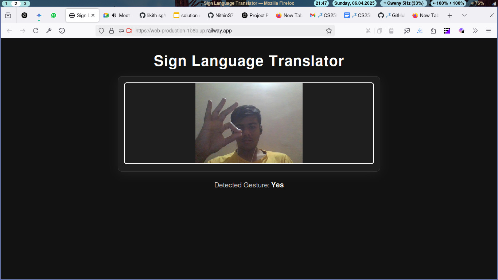
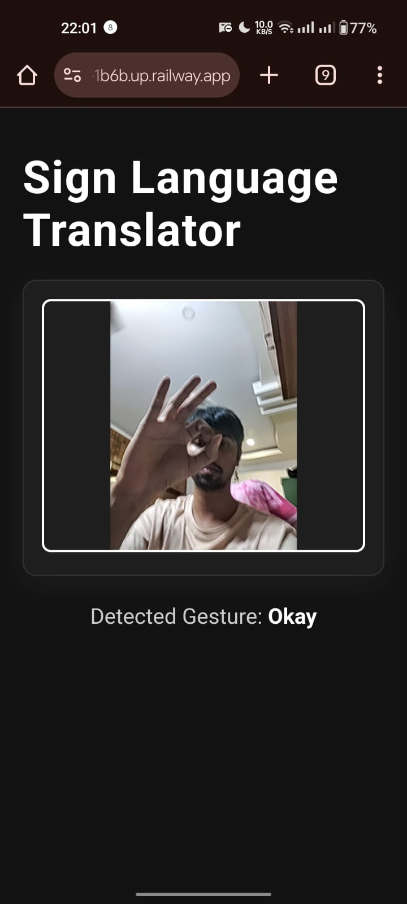

<p align="center">
  
</p>

# Real-Time Sign Language Translator  
### GDG Solutions Challenge 2025 | Team Socrates  

**Project Theme:** *Building an Inclusive World for Neurodiverse Individuals*  
**UN SDG Goal:** Goal 10 – Reduced Inequalities

<p align="center">
  
  &nbsp;&nbsp;&nbsp;
  
</p>

---

## Overview

This project was developed as part of the **Google Developer Student Clubs (GDSC) Solutions Challenge 2025**. Our team, **Socrates**, chose to address Goal 10: *Reduced Inequalities* of the **United Nations Sustainable Development Goals (UN SDGs)**.

We aimed to build an inclusive communication system for neurodiverse individuals, especially those with hearing or speech impairments. Our solution bridges the communication gap between the deaf and hearing communities using **real-time sign language translation** powered by **deep learning and computer vision**.

---

## Team Members

- **Likith S G**  
- **Nithin S**  
- **Mohan Chandra SS**  
- **Mohith R**

---

## Problem Statement

### Building an Inclusive World for Neurodiverse Individuals

Many neurodiverse individuals face barriers to communication, particularly those who rely on sign language. These barriers affect education, social inclusion, and access to opportunities.  
This project addresses the need for real-time translation of sign language into readable text to empower those with hearing impairments and foster inclusivity in society.

---

## Project Description

Our system uses a webcam to capture static hand gestures and translate them into text using a trained deep learning model. It's lightweight, efficient, and suitable for deployment even in low-resource environments like edge devices or mobile platforms.

---

## Demo & MVP

<p align="center">
  <a href="https://youtu.be/k7kyxWCrnjw" target="_blank">
    
  </a>
  &nbsp;&nbsp;
  <a href="https://web-production-1b6b.up.railway.app/" target="_blank">
    
  </a>
</p>

- **Project Demo:** [https://youtu.be/k7kyxWCrnjw](https://youtu.be/k7kyxWCrnjw)  
- **Live MVP:** [https://web-production-1b6b.up.railway.app/](https://web-production-1b6b.up.railway.app/)

---

## MVP in Action – Desktop & Mobile Views

<p align="center">
  <table>
    <tr>
      <td align="center">
        <br/>
        <em>🖥️ Desktop View</em>
      </td>
      <td width="60px"></td> <!-- spacer column -->
      <td align="center">
        <br/>
        <em>📱 Mobile View</em>
      </td>
    </tr>
  </table>
</p>

---

## Methodology

### 1. Dataset Collection
- Images captured using OpenCV via webcam.
- Each gesture class contains 1000 images.
- Run: `python datacollection.py`  
  - Press `S` to save images  
  - Press `Q` to quit

### 2. Data Augmentation
- Improves dataset diversity and prevents overfitting.
- Techniques: rotation, flipping, brightness changes, noise injection.
- Run: `python dataAug.py`

### 3. Model Architecture
- Based on **MobileNetV3** (pre-trained).
- Added custom dense layers for classification.
- Optimized with Adam optimizer and categorical cross-entropy loss.

### 4. Training
- Batch size: 32  
- Epochs: 50  
- Validation split: 20%  
- Checkpointing to resume interrupted training.
- Run: `python model3.py`

### 5. Inference
- Real-time predictions using webcam input.
- Detects hands, predicts gesture, displays bounding box and label.
- Run: `python test.py`

---

## Implementation

## Create Custom Dataset
```bash
python datacollection.py
# Press 'S' to capture images.
# Press 'Q' to quit.
```

## Data Augmentation
```bash
python dataAug.py
```

## Train the Model
```bash
python model3.py
```

## Run Real-Time Inference

```bash
python test.py
```

## Model Performance

| Metric            | Value      |
|-------------------|------------|
| Training Accuracy | 43.53%     |
| Training Loss     | 1.4674     |
| Test Accuracy     | 53.52%     |
| Test Loss         | 1.2869     |
| Training Time     | 2825.66s   |

**Logs stored at:** `logs/fit/20250303-121854`

---

## Prerequisites

- Python 3.10  
- TensorFlow 2.10  
- OpenCV  
- NumPy  
- Matplotlib  
- MediaPipe  

---

## GPU Acceleration (Optional but Recommended)

### 1. Install:

- CUDA Toolkit 11.8  
- cuDNN 8.6.0  

### 2. Verify GPU Access:

```bash
python -c "import tensorflow as tf; print(tf.config.list_physical_devices('GPU'))"
```

## Key Features

- Lightweight, MobileNetV3-based classifier  
- Real-time sign recognition  
- Built-in data augmentation pipeline  
- Easy to expand with new gesture classes  
- 🖥Deployable on laptops, Raspberry Pi, or Jetson Nano  
- Designed for inclusivity and accessibility  

---

<p align="center"><b>Empathy through Innovation | Inclusion through Code</b><br><i>– Team Socrates, GDSC Solutions Challenge 2025</i></p>
